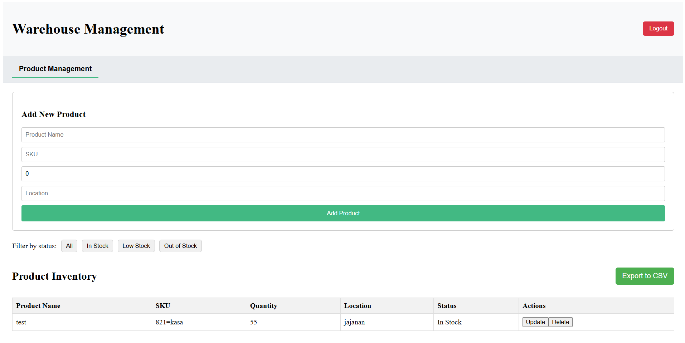
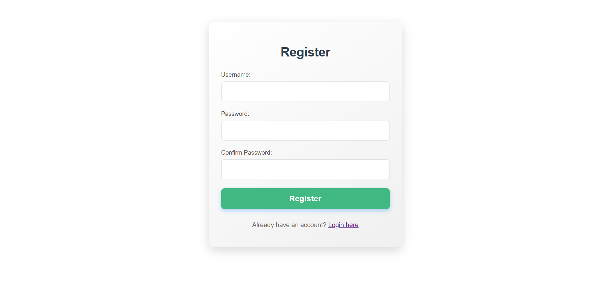

# Sistem Manajemen Gudang

Ini adalah aplikasi web full-stack untuk mengelola produk gudang, menampilkan otentikasi pengguna dan operasi CRUD produk.

## Fitur

*   Otentikasi Pengguna (Registrasi, Login)
*   Manajemen Produk (Tambah, Lihat, Edit, Hapus Produk)
*   API RESTful dengan Go
*   Frontend Interaktif dengan Vue.js

## Teknologi yang Digunakan

*   **Backend:** Go (Golang)
*   **Frontend:** Vue.js
*   **Database:** SQL

## Prasyarat

Sebelum memulai, pastikan Anda telah menginstal yang berikut di sistem Anda:

*   **Go:** [https://golang.org/doc/install](https://golang.org/doc/install)
*   **Node.js & npm:** [https://nodejs.org/en/download/](https://nodejs.org/en/download/)
*   **Database SQL:** Instansi MySQL atau PostgreSQL yang sedang berjalan.

## Instruksi Penyiapan

Ikuti langkah-langkah ini untuk menjalankan proyek di mesin lokal Anda.

### 1. Kloning Repositori

```bash 
git clone https://github.com/TheRabdal/warehouse_TheRabdal.git
cd warehouse_TheRabdal
```

### 2. Penyiapan Backend (Go)

Navigasi ke direktori `backend`, instal dependensi, dan siapkan database.

```bash
cd backend
```

#### Instal Dependensi Go

```bash
go mod tidy
```

#### Penyiapan Database

1.  **Buat Database:**
    Buat database baru di server SQL Anda (misalnya, `warehouse`).

    ```sql
    CREATE DATABASE warehouse;
    ```

2.  **Impor Skema:**
    Impor skema SQL yang disediakan ke database yang baru Anda buat.

    ```bash
    # Untuk MySQL:
    mysql -u nama_pengguna_anda -p warehouse < warehouse.sql

    # Untuk PostgreSQL:
    psql -U nama_pengguna_anda -d warehouse -f warehouse.sql
    ```
    **Catatan Penting!** Anda perlu menyesuaikan string koneksi database di `main.go` atau file konfigurasi (jika ada) agar sesuai dengan kredensial dan host database Anda.

#### Jalankan Backend

```bash
go run main.go
```
Server backend akan dimulai, biasanya di `http://localhost:8080` (atau seperti yang dikonfigurasi di `main.go`).

### 3. Penyiapan Frontend (Vue.js)

Navigasi kembali ke direktori root proyek dan instal dependensi frontend.

```bash
cd .. # Kembali ke root proyek
```

#### Instal Dependensi Node.js

```bash
npm install
```

#### Jalankan Frontend

```bash
npm run serve
```
Server pengembangan frontend akan dimulai, biasanya di `http://localhost:8081` (atau seperti yang dikonfigurasi di `vue.config.js`).

## Penggunaan

Setelah server backend dan frontend berjalan:

1.  Buka browser web Anda dan navigasi ke URL frontend (misalnya, `http://localhost:8081`).
2.  Anda dapat mendaftar pengguna baru, masuk, dan kemudian mengelola produk.

## Pemecahan Masalah / Masalah Umum

### 1. Dependensi Hilang

*   **Go:** Jika `go mod tidy` gagal, pastikan Go terinstal dengan benar dan ada di PATH sistem Anda.
*   **Node.js/npm:** Jika `npm install` gagal, pastikan Node.js dan npm terinstal dengan benar. Coba bersihkan cache npm: `npm cache clean --force`.

### 2. Masalah Koneksi Database

*   **Periksa Kredensial:** Verifikasi bahwa nama pengguna, kata sandi, host, dan nama database di kode backend Anda (`main.go` atau konfigurasi) cocok dengan pengaturan database Anda.
*   **Server Database Berjalan:** Pastikan server MySQL/PostgreSQL Anda berjalan.
*   **Firewall:** Periksa apakah ada firewall yang memblokir port database (default MySQL: 3306, PostgreSQL: 5432).

### 3. Konflik Port

*   Jika backend atau frontend gagal dimulai karena port sudah digunakan, Anda dapat:
    *   Mengubah port di file konfigurasi masing-masing (misalnya, `main.go` untuk Go, `vue.config.js` untuk Vue).
    *   Temukan dan hentikan proses yang menggunakan port yang berkonflik.
        *   **Windows:** `netstat -ano | findstr :<NOMOR_PORT>` lalu `taskkill /PID <PID> /F`
        *   **Linux/macOS:** `lsof -i :<NOMOR_PORT>` lalu `kill -9 <PID>`

### 4. Kesalahan Build Frontend

*   Jika `npm run serve` gagal, periksa pesan kesalahan di konsol. Masalah umum termasuk kesalahan sintaks di komponen Vue atau paket yang hilang. Coba hapus `node_modules` dan `package-lock.json` dan jalankan `npm install` lagi.

### 5. API Backend Tidak Merespons

*   Pastikan server backend (`go run main.go`) berjalan tanpa kesalahan.
*   Periksa tab jaringan di alat pengembang browser Anda untuk kesalahan permintaan API.
*   Verifikasi bahwa frontend membuat permintaan ke URL backend yang benar (misalnya, `http://localhost:8080`).

## Kesimpulan

Proyek Sistem Manajemen Gudang ini menyediakan solusi full-stack yang komprehensif untuk mengelola inventaris produk dengan fitur otentikasi pengguna yang kuat. Dengan backend Go yang efisien dan frontend Vue.js yang responsif, aplikasi ini dirancang untuk skalabilitas dan kemudahan penggunaan. Ikuti instruksi di atas untuk penyiapan dan pemecahan masalah guna memastikan pengalaman pengembangan yang lancar.

## Gambar Hasil


